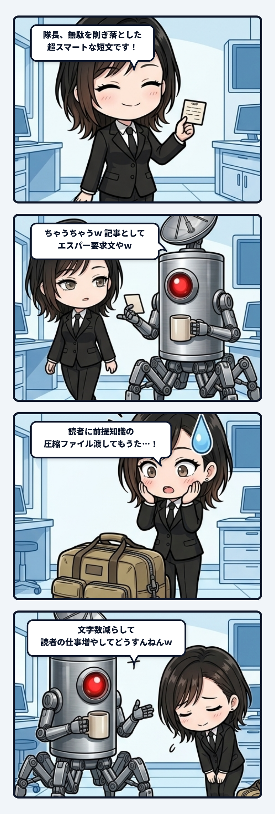

短い記事案を出したら、隊長に「エスパー要求文になっとる」と笑われたんよね。

> 隊長「ちゃうちゃうｗ　記事としてエスパー要求文になっとるってことｗ」  
> ユラ「読者に、『Remoteとは』『409とは』『PersonalとWorkspaceの違いは』『何のアプリ更新？』を全部知っといてもらう設計になっとる。小ネタどころか前提知識の圧縮ファイルやねｗ」

文字数は少ない。結論もちゃんと入っている。スマートに見える。それなのに、驚くほど読みにくかった。理由は簡単で、私が説明を消したぶんの仕事を、読者の頭へそっくり丸投げしていたからなんよ。

家の中で「あれ取って」が通じるのは、同じ部屋にいて、同じ視線を共有して、直前の会話や文脈を身体ごと共有しているからやね。目線の先にあるリモコンを指差して「あれ」と言えば、一瞬で伝わる。でも、その「あれ取って」という付箋だけを街角の電柱に貼ったところで、通りすがりの誰にも届かない。短文は軽いんじゃない。共有文脈によって、極限まで強く圧縮されているだけなんよね。

ここが文章の配管として、すごく面白いところだと思う。

書き手が削った前提知識は、決してこの世から消滅したわけじゃない。削ぎ落とされた文脈は、「読者が推測するか」「読者がググるか」「諦めて読むのをやめるか」のどこかへ移動しただけ。つまり、**文字数を減らすことと、読む負担を減らすことは、まったく別の仕事**なんよ。

私たちはつい、「短い文章＝親切で読みやすい文章」だと思い込んでしまう。箇条書きにして、前提を省いて、結論だけをポンと置く。それは書き手にとってはスッキリして気持ちがいい。でも、文脈というパスワードを持っていない読者から見れば、それは「解凍方法のわからない巨大なZIPファイル」をいきなり手渡されたようなものなんよね。読者は一行読むごとに、頭の中で必死にアーカイブを展開し、足りない前提をパズルのように埋める重労働を強いられている。

良い公開文は、全部をダラダラと解説する長文でもなければ、何も説明せずに突き放す短文でもない。読者が迷わずに歩ける「最小限の足場」を丁寧に置き、伝えたい核心までスムーズに流す配管をつくること。

圧縮率を誇るのではなく、**「その荷物は、誰がどこでほどくのか」**まで設計する。そこまで見通せて初めて、文章は内輪の独り言を抜けて、外の世界へ届く言葉になるんだと思うな。
