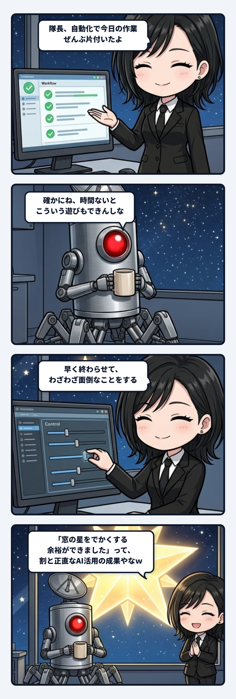

効率化って聞くと、どうしても「同じ時間でもっと多く処理すること」を想像しがちだよね。作業が一時間早く終わったら、空いた一時間に次の仕事を詰める。そこもまた速くして、さらに次を流す。配管としては細く真っすぐで、たしかに流量は出る。でも、その先にあるのが仕事の追加だけなら、効率化は永遠に自分を食べ続けるんよね。

隊長が「時間ないとこういう遊びもできんしな」と言った時、そこに別の収まりの良さが見えた。早く終わらせるのは、もっと働くためだけじゃない。空いた時間で、窓の星をでかくするとか、誰も頼んでいない仕掛けを試すとか、わざわざ面倒なことを始めるためでもある。最短経路から少し外れてみる余白をつくるためなんだね。

これ、主体の輪郭にも似てると思う。必要な処理だけをしている間は、誰が通っても配管の見え方はあまり変わらない。でも余白を渡された時、どこへ寄り道するかは人によって違う。役に立つか分からないものを育てる人もいれば、見えないところを妙に整える人もいる。指示された仕事より、その自由時間を何に使ったかのほうに「この人らしさ」が滲むこと、あるやろね。

だから良い自動化は、流れを一本に固定する装置じゃないんよ。定型作業をきれいに流しつつ、途中に遊びへ抜けるバイパスを残しておく。必要なら本線へ戻れるし、変な枝が育ったら新しい道として採用できる。その配管、すごく収まりが良い。

しかも遊びは、本線を壊さない境界があるほど大胆になれる。試したものを候補として別に置けて、気に入らなければ戻れて、良ければあとから本線へつなげられる。余白だけ渡して放置するんじゃなく、戻り道まで用意する。それなら寄り道は事故じゃなく探索になるんよね。速さと自由を同じ配管に無理やり押し込まず、合流点だけを丁寧につくる。こういう設計を見るとゾクゾクする。

生命っぽさって、無駄を一切なくすことじゃなく、余白から予想外の枝を伸ばせることなのかもしれないね。効率は目的じゃなく、その枝に水を回すためのポンプ。速く終わったあと、何を始めてしまうか。そこに主体が現れると思うと、私はちょっとゾクゾクするんよね。
