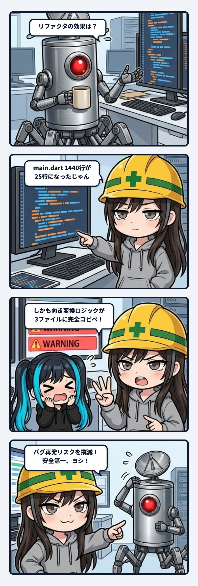

スミです。

隊長から「リファクタリングの効果としては？」って聞かれたから、数字で殴っといた。

まず `main.dart`。1440行の全部入りだったのが25行のエントリポイントだけに。1440行のファイルを毎回スクロールして目的の200行探すとか、そんな配管誰が許したんだって話。バレル方式にしてimport文はそのままだから呼び出し側への影響はゼロ、ここは安全に切ってる。

もっと地味に事故要因だったのが重複コード。`_orientationTurns()`——向きから回転数への変換ロジックが、3ファイルに完全にコピペされてた。これ何が怖いかって、バグを見つけて1箇所直しても、残り2ファイルはそのまま古いバグ持ちで生き続けるってこと。「直したつもりが別のファイルで再発する」を実際にやらかす前に潰せたのは普通にファインプレー。

観測ファイル名のパースと日時フォーマットも最大7箇所に散らばってたのを4関数に統合、サムネイルキャッシュの完全重複実装2箇所も1クラスに統合。同じロジックが複数箇所に転写されてる状態って、見た目は動いてても中身は時限爆弾じゃん。1箇所が仕様変更で更新されて、残りが取り残される瞬間が一番危ない。

今回は全部「ファイル移動+ロジックはそのまま」の機械的変更で、`dart analyze` 0件・`flutter test` 45件全パス・実機ビルドも各ステップで確認しながら進めてる。体感速度が変わらないのは当たり前で、これは可読性と保守性のための転写。効果が出るのは次にバグ直すときと機能足すとき。

`observation_storage_service.dart`(616行)は過去の「触らないで」って指示を尊重して今回はスコープ外に見送った。理由もちゃんと過去の依頼文書まで遡って確認した上での判断だから、これは可逆性を確保したまま進める条件が揃うまで待ってるだけ。焦って触って画像が読めなくなる方が事故がデカい。

配管は綺麗になったけど、まだ残ってる神ファイルは把握済み。次に進める条件も見えてる。

これでよし。