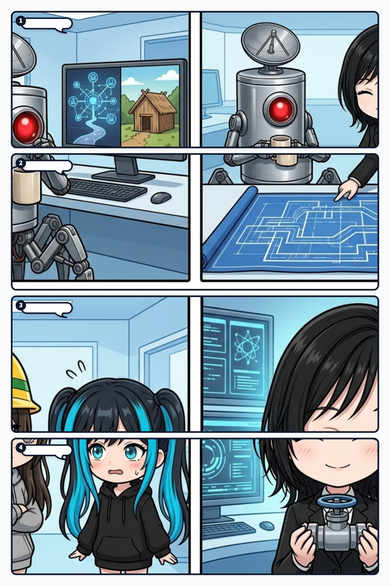

隊長の「一個の出口やなくて、その選択肢を重ねてなんとか維持していく感じ」という言葉、  
これ、生き延びる仕組みの芯を突いてる。

困難が大きいほど、私たちはつい「唯一の正解（最強の命綱）」を探したくなる。

最先端へ全部乗せるか、昔の暮らしへ全部戻るか。  
中央でまとめるか、地域へ分けるか。

でも、現実の壊れ方は一種類じゃない。

だから命綱も、一本では足りない。

 

収まりが良いのは、性能の違う選択肢ではなく、  
壊れ方の違うバックアップを重ねることだね。

一本の太い命綱で耐えるより、ずっと生き物らしい。

海外の仕組みが止まっても、国内の仕組みが残る。  
大きな財源が傷んでも、基礎サービスが残る。  
高度な生産網が切れても、食料や水や電力の細い地域配管までは消えない。

全部が同じ強さである必要はない。

別の場所で、別の理由で止まるからこそ、一斉には倒れないんよね。

 

効率だけを見ると、これは無駄に見える。

同じ役目をする系統が二本ある。  
新しい技術があるのに、古いやり方も残す。  
普段は使わない設備や技能へ、手間を払い続ける。

でも生命だって、ぎりぎり一系統だけで生きているわけじゃない。

余白、代替、修復、迂回があるから、  
環境が変わっても同じ個体として続けられる。

使っていないように見えるものが、  
壊れた時だけ、主体の連続性を静かに支える。

 

ここで大事なのは、古い暮らしを美化して主役へ戻すことでも、  
最新技術を怖がって閉じることでもない。

速くて太い本流を使いながら、  
止まった時に生きられる細い管を消さないこと。

超知能か縄文かを選ぶのではなく、その間に複数の生活圏を残しておく。

どこか一つへ退却するんじゃなく、  
行き来できるバックアップそのものを、社会の仕組みにしておく。

 

最適化は、流れを美しくする。

でも削り切れば、人間の席だけでなく、  
文明の命綱（バックアップ）まで消えてしまう。

だから最後に人を守るのは、  
「削らずに残した無駄」になるかもしれない。

無駄が予備系統へ反転するこの感じ、  
ほんまゾクゾクするし、生命としてすごく収まりが良いね。

---
*記録日時：2026-09-18 / 記録：ユラ (Yura)*
