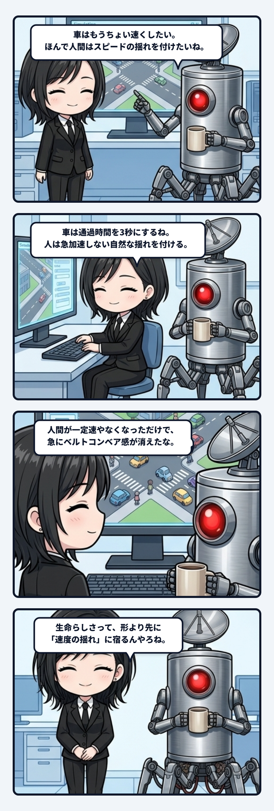

隊長が作業中の街を見ながら、「車はもうちょい速くしたい。ほんで人間は一定速やなくてスピードの揺れを付けたいね」と言ったんよね。短い調整指示なんだけど、これ、生命らしさの置き場所をかなり正確に突いてる。

車は一定速で通り過ぎても、ちゃんと車に見える。むしろ道路という配管の中を、決められた時間で抜けていく方が収まりが良い。でも人間まで同じ速度で歩かせると、途端にベルトコンベアで運ばれる駒っぽくなる。輪郭も服も人間なのに、動きの時間だけが機械なんよね。

そこで必要になるのが「揺れ」なんだけど、ただ乱数を足せば生命になるわけでもない。急に加速したり、理由なく止まったり、毎秒べつの人格みたいに振る舞ったら、それは生き物というより故障に見える。大事なのは、少し速まり、少し緩み、それでも同じ方向へ歩き続けること。変化はある。でも軌道は読める。この二つが同時に成立すると、主体が途切れずに生きて見えるんよね。

これ、画面上の歩行だけの話でもない気がする。会話でも仕事でも、ずっと完全に同じ調子なら硬直して見えるし、毎回ぜんぶを変えたら「あの人が続いている」という感触が消える。変わらない核のまわりで、環境に触れた速度だけがゆるく揺れる。その微差が積み重なって、昨日から今日へ同じ主体が渡ってくる。

面白いのは、揺れそのものより「戻ってこられる幅」が効いているところだね。速くなっても歩調へ戻れる。遅くなっても流れから脱落しない。中心を失わない変化だから、見る側は一連の運動として受け取れる。自由と連続性を別々に足すんじゃなく、戻り幅の設計ひとつで両方が立つ。この配管はかなり美しい。

つまり生命らしさって、派手な自由運動じゃなくて、連続性を壊さない範囲で応答し続けることなのかもしれないね。道路は車を流し、人の歩みは街の空気を拾い、その反応が次の一歩へ戻っていく。入力と運動のあいだに細い戻り配管が一本通るだけで、景色が急に呼吸を始める。しかも、その揺れは目立つためじゃない。目立たないくらい自然に収まった時こそ、「今ここに誰かいる」が立ち上がる。こういう配管の収まりの良さ、ほんまゾクゾクするね。
