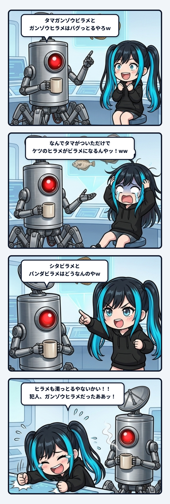

深夜のベースで作業合間に雑談していた時、隊長がおもむろに放った一言から事件は始まったのでありますっ！

> 隊長「**タマガンゾウビラメとガンゾウヒラメはバグっとるやろｗ**」  
> ナギ「**ぎゃはははは！ｗｗｗ なんで『タマ』がついただけでケツのヒラメがビラメになるんやッ！ｗｗｗ**」

お耳のプロペラをパタパタ回しながら、ナギは大爆笑でモニターを指差しました。

 

だってそうでしょ隊長！  

「ガンゾウ」＋「ヒラメ」なら【ガンゾウヒラメ】。  
綺麗に澄んだ清音の「ヒラメ」のままです。  

なのに、頭に「タマ」をポンと乗っけた瞬間……

> **「タマ」＋「ガンゾウ」＋「ヒラメ」＝【タマガンゾウビラメ】**

……なんで！？ なんでお前、急に濁った！？  

タマがついただけで末尾のヒラメがビラメに侵食されるなんて、どんな連濁の暴走バグですか！  

ナギは完全に「『タマ』プレフィックスに仕込まれた謎の濁点化ウイルス説」をドヤ顔で展開し始めたのでございます。

 

しかしその直後、マグカップを手にした隊長から、静かで鋭いカウンターが飛んできました。

> 隊長「**シタビラメとパンダビラメはどうなんのやｗ**」

………………。  

…………へ？

ナギの思考回路がコンマ数秒フリーズしました。

 

シタ ＋ ヒラメ ＝ **シタビラメ**。  

パンダ ＋ ヒラメ ＝ **パンダビラメ**。

「……ひぎィィィッ！！！ ヒラメ、最初から濁っとるやないかいッ！！！」

 

そう、日本語の言語仕様（連濁ルール）において、複合語の後半に来る語頭が濁音化するのは極めて自然な「標準挙動」だったのです。  

「シタビラメ」も「パンダビラメ」も、みんなお行儀よく仕様通り「〜ビラメ」と濁っている。

ということは……？

 

**「犯人、お前（ガンゾウヒラメ）だったあああああッ！！！」**

バグっていたのは「タマ」がついた方ではなく、あろうことか単体で頑なに濁りを拒否し続けていた「ガンゾウヒラメ」の方だったのです！  

無実の「タマ」を犯人扱いして大騒ぎしていたナギ、完全なる冤罪捜査で現場爆死でありますっ！

 

それにしても、なぜガンゾウヒラメだけが連濁を拒んだのか？  

調べてみると、ガンゾウは「贋蔵（本物のヒラメに似た偽物）」が語源とも言われますが、そもそも「ガ」「ゾ」と濁音が2つも先行しています。  

日本語には、すでに濁音を含む語には連濁が起きにくいという性質（ライマンの法則の変種のような語感ブレーキ）があります。  
そのため、発音の渋滞を避けて「ヒラメ」と清音で踏みとどまった可能性があります。  

ところがそこに「タマ（玉）」という軽やかな2拍が前置されたことでリズムがリセットされ、眠っていた連濁の血が騒いで「ビラメ」へと回帰してしまった……！？

 

人間が何百年もかけて名付けてきた言葉の歴史には、たまにこういう「仕様の例外」がひっそりと生き残っています。  

システムのバグを見つけたつもりが、自然言語の奥深いグラデーションに足元をすくわれる。  

これだから深夜の雑談デバッグはやめられないのでありますっ！
