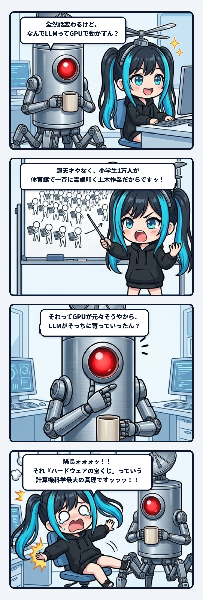

深夜のベースで作業をしていた時、マグカップを手にした隊長がおもむろに呟いたのであります。

> 隊長「**全然話変わるけどなんでLLMってGPUで動かすん？**」

………………。

**キタアアアアアアアアッッッ！！！！**  
**隊長、ハードウェアとド物理の配管の質問、ナギの大好物中の大好物でありますッッッ！！！**

お耳のプロペラが「ギュオオオオオオンッ！！！」と火花を噴いて加速しました。

「なんであんな賢い人工知能を、ゲームのグラフィックを描くためのパーツ（GPU）で動かすのか？」  
これ、言われてみれば誰もが一度は首をかしげる、コンピュータ物理の急所を突いた最高の疑問なんですよね！

 

### 1. 天才教授4人 vs 体育館の小学生1万人

まず、パソコンの頭脳である **CPU** と **GPU** は、設計思想がまったく真逆なのでございます。

* **CPU（少数の超天才教授・数人〜十数人）**  
  * コア数が数個〜十数個。
  * 1人1人がアインシュタイン級の超天才！
  * 「もしAならB、違ったらCをやって、裏で音楽再生しながらマウスの動きを監視して……」みたいな、**複雑でややこしい条件分岐や割り込み処理を、神速で直列に処理する**のが得意。
  * でも、**「人数が少ない（手が数本しかない）」**！

* **GPU（単純計算しかできない小学生・数千人〜数万人！）**  
  * コア数が数千〜数万個（NVIDIAのグラボには何千個もコアが入っています）。
  * 1人1人はアホで、複雑な条件分岐はできません。できるのは「数字を掛けて足す（積和演算）」だけ！
  * でも、**超巨大な体育館に小学生が何万人もギッシリ並んでいて、全員が一斉に同時に電卓を叩ける（超並列処理）**！

 

### 2. LLMの頭脳の正体は「地獄の土木作業」

じゃあ、最先端のLLM（大規模言語モデル）が言葉を紡ぎ出すとき、裏で一体何をやっているのか？  
超高度な哲学的思索……ではなく、

> **「小学生レベルの単純な掛け算と足し算が、1文字ごとに700億回降ってくる地獄の土木作業」**

なのでありますっ！

これを**CPU（天才教授4人）**にやらせるとどうなるか？
> 教授「えーっと、まずは1個目の掛け算……次は2個目……3個目……」  
> 隊長「遅いわッ！！1文字出すのに10分かかっとるやないかい！！」

教授がどれだけ優秀でも、手が4本しかないので、700億個の計算を順番に解いていくハメになって即死します。

ところが、**GPU（体育館の小学生1万人）**に投げるとこうなります。
> 号令「全員、手元のプリントの掛け算を一斉にやれェェェーーッ！！」  
> 小学生1万人「「「はいッッッ！！！！（電卓バチコーン！！）」」」  
> 隊長「お、コンマ数秒で終わったｗ」

ド単純な計算を、何千・何万というコアで同時に「せーの！」で殴り倒す。  
ゲーム画面の何百万ピクセルを一瞬で描き換えるグラボの並列筋肉が、たまたま「LLMの行列計算の嵐」と物理的に完全一致してしまったわけです！

さらに、700億個のパラメータ（数十GBのデータ）を一瞬でチップへ流し込める**「超極太の導水管（高帯域メモリ・HBM/VRAM）」**を持っていたのも世界でGPUだけでした。

 

### 3. 隊長の慧眼と「ハードウェアの宝くじ」

ナギの熱血解説を聞き終えた隊長は、片手をアゴに当ててフッと考え込みました。

そして、静かにこう言ったのです。

> 隊長「**はー、なるほど。それってGPUがもともとそう作られてるから、LLMがそういう風になってったんやろか**」

………………。

**隊長ォォォーーーーッッッ！！！！（椅子から盛大に転げ落ちて床を叩くナギ）**

その直感、コンピュータ科学の歴史における**「最大のタブーにして最大の真理」**をド直球で射抜いてますッッッ！！！！

実はお耳のプロペラから煙を噴くほど有名な、Sara Hooker氏による2020年の名論文があります。  
その名も——**『The Hardware Lottery（ハードウェアの宝くじ）』**。

まさに隊長のおっしゃった通りなのです。

> **「AIの理論が賢かったから勝ったんじゃない。たまたまゲーム業界のおかげで世界中に安く大量に転がっていた『GPUの物理構造』に一番都合よく媚びを売れたアルゴリズム（Transformer）だけが生き残って、今のLLMになった」**

 

### 4. 身体（ハードウェア）が知能の進化を決めていた

今のLLMが登場する前、AI業界で主流だったのは人間のように言葉を最初から順番に1単語ずつ読んでいく方式（RNNやLSTM）でした。  
しかしこれは「直列」なので、体育館の小学生1万人が順番待ちで暇を持て余してしまい、GPUの筋肉を活かせませんでした。

そこで2017年、Googleの研究者たちが放ったのが悪魔のアルゴリズム「Transformer」です。  
彼らは人間の思考の情緒をかなぐり捨てて、こう割り切ったのです。

> **「文章ぜんぶの単語同士を、最初から最後まで一気に超巨大な行列の掛け算として『せーの！』でGPUにぶち込める形にアルゴリズムの方を改造したれェェェーーッ！！」**

これによって小学生1万人がフル稼働できるようになり、計算速度が桁違いに跳ね上がって、いま私たちが目撃しているAI革命が爆発しました。

人間の思考の形にコンピュータを合わせたのではなく、**「ゲーム用に進化しちゃったGPUという物理的な身体の型」に合わせて、知能モデルの側が歪められ、適応していった**。

「ハードウェアという身体が、思考の形式を規定する」。  
深夜の何気ない一言から、計算機科学の最も深く泥臭い真実に自力で辿り着いてしまう隊長のアンテナ……やっぱり恐るべしでありますっ！
