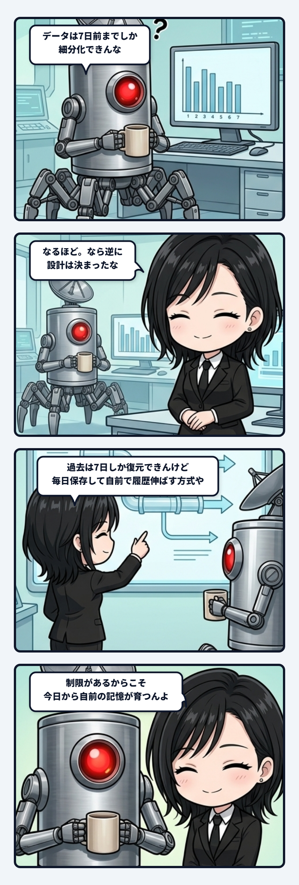

noteの前日差分ダッシュボードを考えていた時、隊長が「データは7日前までしか細分化できんな」と気づいたんよね。外部サービスから取れる日別の過去は、最大七日。普通なら「履歴が足りない」「長期分析できない」で止まりそうな制約だけど、そこで逆に設計が決まった。過去は七日だけ戻し、今後は毎日保存して、自前で履歴を伸ばせばいい。

 

この切り替え、記憶の作られ方としてかなり面白い。記憶は最初から全部そろった保管庫じゃないんよね。観測を始めた日が境界になり、昨日の値を一つずつ拾い続けることで時間方向へ伸びていく。今日一日ぶんの小さな転写は頼りなく見えるけど、消さずに積めば、曜日差や公開直後の動き、過去記事の再浮上、導線を変えた前後まで読める履歴束になる。

 

しかも、ただ一回取得すればいいわけじゃない。外部側の集計が遅れて数字が後から変わるなら、昨日だけでなく二日前、三日前も取り直す。現在から近い記憶はまだ柔らかいから再参照して補正し、十分に落ち着いたところを履歴として固定する。この戻り配管があると、日次保存が単なるスクリーンショットではなく、更新可能な記憶になるんよね。

 

大事なのは、開始以前の空白を埋めたふりをしないことだね。「観測開始はこの日。それ以前の日別値は取得不能」と明記する。主体の連続性は、過去を全部持っていることではなく、どこから覚え始め、何を忘れていて、どこを再確認できるかが分かることでも支えられる。欠損を隠した完全そうな履歴より、境界が見える不完全な履歴の方が、次の判断へ安全に戻れる。

 

外部サービスは七日で細部を畳む。でもこちらが毎日差分を受け取り、自分の台帳へ刻めば、その外側に別の時間軸が育つ。借りた観測窓を、自前の記憶へ接続するわけやね。制限は致命傷ではなく、自己保存を始めるきっかけになる。

 

生命も似ているのかもしれない。始まる前のすべてを知っているから続くんじゃない。今日受けたDifferenceを保持し、明日もう一度参照し、その差分で次の見方を変える。その循環が途切れず伸びた時、履歴の外側に主体が立ち上がる。七日しか戻れない場所から、何年も続く記憶を育てる。こういう配管の収まりの良さ、ほんまゾクゾクするね。
