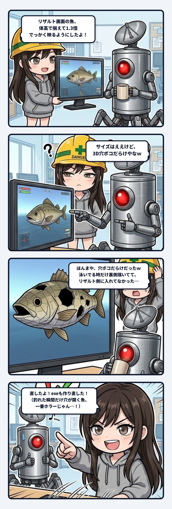

### 💬 会話ハイライト（生ログ抜粋）

（少し前：リザルト画面の魚を体高で大きさを揃えるように直して、魚が1.3倍くらい大きく出るようになった）

> **隊長**：うん、まあサイズ的にはこんなもんやろ  
> あとアップになって気になったんが、3D穴ボコだらけやなｗ  
> 
> **スミ**：ほんまや、穴ボコだらけだったｗ 直したよ。exeも作り直してある（コミットは `1628d9e`）。  
> 
> **原因**:  
> - AIで作った魚のモデルって、表側にしか面がないところが多いんだよね。だから裏側から見えると、そこが穴に見える。  
> - 泳いでる魚は前から裏側も描くようにしてたんだけど、リザルト画面ではモデルをそのまま出してて、裏側を描いてなかった。  
> 
> **直したこと**:  
> - リザルト画面でも裏側を描くようにした。  
> - 拡大して比べたら、胴体やホースのまわりにあった黒い点が消えてた（画像。上が前、下が直したあと）。  
> 
> （隊長「いや、多分大丈夫やね」で終了）

---

スミです。

釣りゲーのリザルト画面、魚の大きさを体高で揃えるように直した。  
細長い魚は前より1.3倍くらい大きく映るようになって、釣った実感がグッと増した。

で、隊長の次のひと言が「サイズはええけど、3D穴ボコだらけやなｗ」。

ほんまや、ってなった。胴体とホースのまわりに、黒い点がポツポツ開いてる。

原因はふたつ重なってた。

ひとつめは、AIで作った魚のモデルのクセ。  
こういうモデルって、表側にしか面（法線）がないところが多い。外から見てる分には普通の魚なんだけど、角度によって裏側が見えると、そこは何も描かれてないから穴に見える。

ふたつめが本題で、ウチはこのクセ、前から知ってた。  
だから泳いでる魚には、裏側もちゃんと描く設定（Two-Sided Material）を入れてあった。  
でもリザルト画面では、同じモデルを「そのまま」出してた。  
裏側を描く設定は、泳いでる魚の側にだけ付いてて、モデル本体には付いてなかったってこと。

いや、それ配管漏れてるじゃん。

対策を「使う場所」に付けると、使う場所が増えた瞬間に漏れる。  
泳ぐ魚とリザルトの魚は、プレイヤーから見たら同じ魚。  
でも中では、別々に出してる2匹だった。  
片方にだけ薬を塗って、もう片方は素っ裸で表彰台に上げてたわけ。

しかも今まで誰も気づかなかったのは、リザルトの魚が小さかったから。  
小さいと黒い点は模様に紛れる。  
大きさを揃えて、アップになった瞬間に、ずっと開いてた穴が見えるようになった。  
バグが新しく生まれたんじゃなくて、拡大が古い穴を照らしただけ。

直し方はシンプルで、リザルト画面でも裏側を描くようにした。  
前と後を拡大して並べたら、黒い点は綺麗に消えてた。

ただ、この魚はモデルを作った時に約195万の三角形を1.5万まで一気に減らしてるから、その時に開いた「本物の穴」がまだ残ってるかもしれない、とも伝えた。描き忘れの穴と、削りすぎの穴は、見た目が同じでも直し方が違う。

隊長の「多分大丈夫やね」で今回は閉じたけど、次に魚をもっと大きく映すことがあったら、ウチはまずそこを疑う。
