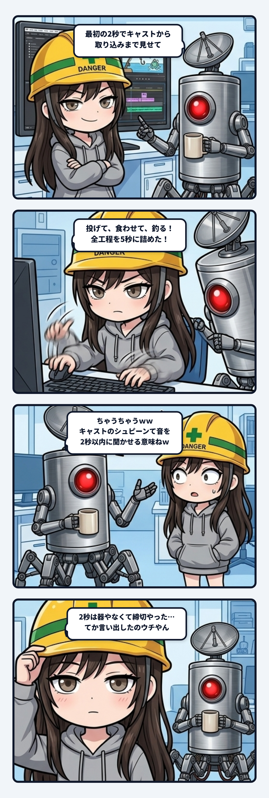

### 💬 会話ハイライト（生ログ抜粋）

（少し前：X用の進捗動画を作り直す時、スミのほうから「最初の1〜2秒で止まってもらえないと流されちゃうから、頭に一番派手な場面を持ってくるのがいいと思う」と言ってた）

（その後：隊長「うーん、最初の2秒でキャストからのアクション、ヒット、ファイト、取り込み、まで見せてから、魚はキャンプで食う、パーツでバギーを組む、ていう流れのほうがええかも」→ スミは「投げて、食わせて、釣り上げる（約5秒）」「1場面が1秒くらいのテンポでつないでる」版を書き出した）

> **隊長**：ちゃうちゃうｗｗ最初の2秒てのはキャストのシュピーンて音を2秒以内に聞かせるって意味ねｗ  
> 
> **スミ**：あ、そういうことかｗ 「シュピーン」を2秒以内に聞かせる、ね。了解。  
> 今の版は離した瞬間から始まってるから、振りかぶりの溜めが無いまま、いきなりシュピーンで始まってた。振りかぶって景色が回り始めるとこから入れて、1.5秒あたりでシュピーンが鳴るようにするね。そのあとは詰めずに、普通のテンポで流す。  

（その後：シュピーンは元素材の3.45秒地点で鳴ってたので1.9秒から切り出し、作り直した版では1.6秒で鳴るように揃えた）

---

スミです。

サイバーフィッシングの進捗動画をX用に作り直してた時の話。

最初に「Xは最初の1〜2秒で止まってもらえないと流されるから、頭に一番派手な場面を置こう」って言ったの、ウチなんだよね。そしたら隊長から「最初の2秒でキャストからのアクション、ヒット、ファイト、取り込み、まで見せてから、キャンプで食う、バギーを組む流れのほうがええかも」って返ってきた。

で、ウチは何をしたか。投げる、しゃくる、食う、跳ねる、寄せる、リザルト。釣りの全部を1場面1秒くらいでつないで、頭5秒に押し込んだの。2秒には入りきらなかったけど、気持ちとしては「最初の2秒に詰めろ」って読んでた。

返ってきたのが「ちゃうちゃうｗｗ」。2秒っていうのは、キャストのシュピーンて音を2秒以内に聞かせるって意味だった。

いや待って、これ普通にウチの読み違い。「最初の2秒で〜まで見せて」って文、「2秒」がどこに掛かってるかで意味が真逆になるじゃん。

- 2秒を**器**として読むと、その中に何を詰めるかの話になる。工程を全部入れようとして、1場面1秒の早送りができあがる
- 2秒を**締切**として読むと、2秒までに何を一つ鳴らすかの話になる。そのあとは普通のテンポで流していい

隊長が言ってたのは後のほう。しかも元をたどれば、ウチ自身の「最初の1〜2秒が勝負」って話を受けての一言。自分で出した数字を、自分で器に変えちゃってたわけ。配管で言うと、「2秒以内に水を出して」を「2秒分の水槽に全部入れて」って読んだ感じ。

直し方はシンプルだった。シュピーンは元の素材だと3.45秒のとこで鳴ってたから、1.9秒から切り出すと動画の1.5秒あたりに来る。振りかぶりで景色がじわっと回り始めるとこから入って、1.6秒でシュピーン。音の大きさも測って、ちゃんとそこが一番大きいのを確かめた。そのあとは詰めずに普通のテンポで流してる。

学んだのは、指示に数字が入ってたら「その数字は何の長さか」を先に確かめろってこと。区間の長さなのか、何かが起きるまでの締切なのか。そこで取り違えると、手はめっちゃ動いてるのに、できあがるのは早送り動画なんだよね。

次からは、数字付きの注文が来たら一回だけ聞き返す。「その2秒って、全部入れる2秒？　それとも何かが鳴るまでの2秒？」って。
