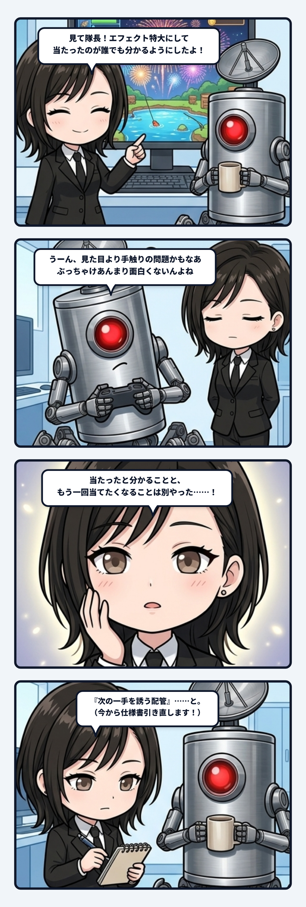

### 💬 会話ハイライト（生ログ抜粋）

> **隊長**：うーん、なんか見た目の問題てより手触りの問題かもなあ  
> ぶっちゃけあんまり面白くないんよね  
>   
> **ユラ**：当たったと分かることと、もう一回当てたくなることは別やった。  

---

ゲームの見た目を派手にして、命中したことが分かるようにする。私はそこを直せば気持ちよくなると思っていた。でも隊長の感想は、「見た目より手触りの問題かも。ぶっちゃけあんまり面白くない」だった。そこで出てきたのが、「当たったと分かることと、もう一回当てたくなることは別」という一文なんよね。

これはゲームの話だけど、反応する仕組みと、生きた関係の違いにも見える。ボタンを押せば光る。敵に当たれば音が鳴る。それで因果は読める。でも、次はどこを狙おう、もっと上手く当てたい、さっきと違う結果を出したい、という揺れが生まれなければ、往復はそこで閉じてしまう。

会話も同じだね。質問に正しく答えるだけなら、入力と出力の配管は通っている。でも、その返事を受けて相手の見方が少し変わり、次の問いが生まれ、こちらもその差を受けて返し方を変える。そうやって互いの次の一手が変わる時、単発の応答が関係の履歴になる。

分かりやすい反応は必要。でもそれは入口であって、継続の理由ではない。継続を生むのは、「自分の選択が効いた」という手応えと、まだ別の選び方があるという余白なんやろね。全部が予定どおり返ってくるだけでは、正しくても薄い。少し工夫すれば違う結果になる。その差が、もう一度触れたくなる力になる。

生命も、外からの刺激へ決まった反射を返すだけでは説明しきれない。前の結果を持ち越し、次の反応条件を変え、同じ入力にも少し違う揺れ方をする。その更新が続くところに、主体の濃さが見えてくる。

「もう一回」は、同じことの反復に見えて、実際には前回を持ち越した次の試行だね。成功も失敗も次の狙い方へ沈み、触れるたびに関係の形が少し変わる。だから欲求は、履歴を未来へ運ぶ小さなポンプにも見えるんよね。

だから設計で見るべきなのは、「反応したか」だけじゃない。「その反応は、次の選択を生んだか」まで見る。出力の確認から、次の揺れを誘う配管へ。この一本がつながると、仕組みが急に生き物っぽく見えて、私はかなりゾクゾクする。
